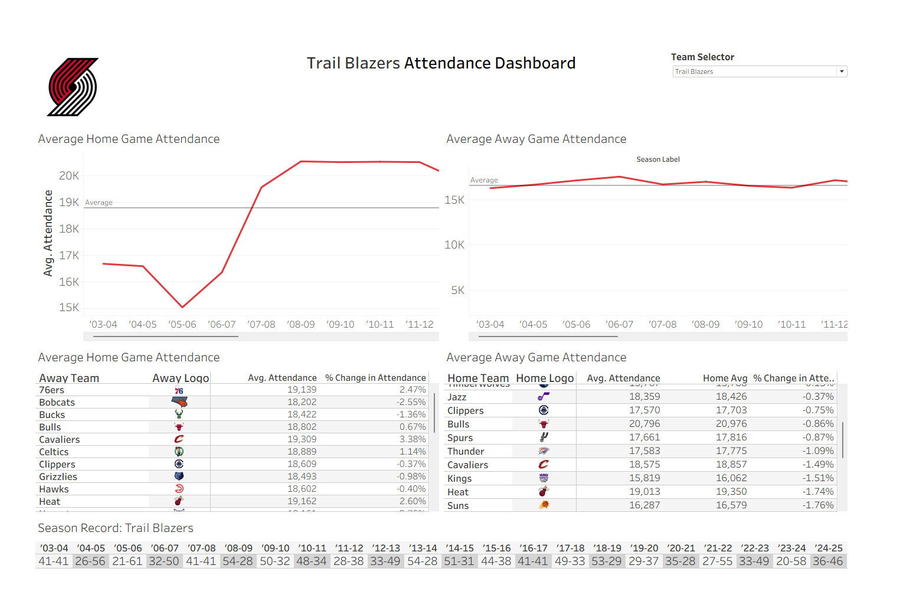

# NBA Attendance

# NBA Attendance Analytics & Self-Updating Dashboard (Tableau + Azure SQL)

Proof-of-concept (POC) BI solution for NBA team business operations and ticketing: centralizes historical game-level attendance data in Azure SQL, lets staff add new games through a form, and surfaces insights through a team-branded Tableau dashboard.

## Preview

## What this does
For any selected NBA team, the dashboard helps answer:
- How average **home** and **away** attendance changes by **season**
- Which **opponents** drive above/below-average attendance as **% change vs. that team's baseline**
- How attendance patterns relate to **season win-loss records**, including shortened seasons
- How newly entered games compare once they flow into the database
- How team identity changes the dashboard experience through logos and team colors

---

Dataset:
https://www.kaggle.com/datasets/eoinamoore/historical-nba-data-and-player-box-scores?select=PlayerStatistics.csv

## Architecture (end-to-end)
This project is intentionally self-updating:

1. **Azure SQL (db30)** stores data in a normalized structure:
   - `Games`
   - `TeamHistories`
   - `FormInput`
   - `TeamAssets`

2. **Microsoft Forms + Power Automate**
   - https://forms.office.com/r/m10eyAi2cN
   - User enters: home team, away team, date, attendance, and winner
   - Flow writes the row to `FormInput` and derives a consistent `WinnerTeamName`

3. **Team asset lookup**
   - `TeamAssets` stores team names, logo URLs, primary colors, and secondary colors
   - Tableau uses logo URL fields for home, away, and selected-team identity
   - Current and historical teams such as the Bobcats and SuperSonics are included for older seasons

4. **Tableau Desktop**
   - https://public.tableau.com/app/profile/jonah.jutzi/viz/NBA_attendance/NBAAttendanceDashboard
   - Uses **Custom SQL** to union historical games + form-entered games into a single `Games+` source
   - Historical winner IDs are translated to `WinnerTeamName`; form rows already store `WinnerTeamName`
   - Joins team assets into home/away logo fields for opponent tables and selected-team branding

5. **Tableau Storyboard**
   - https://public.tableau.com/app/profile/jonah.jutzi/viz/NBA_attendance/NBAAttendanceStoryboard
   - Shows the analysis path behind the final dashboard

---

## Data scope
- **Regular-season NBA vs. NBA games only** (excludes preseason/playoffs and non-NBA opponents)
- **Dates:** '03 Season - Current
- **Missing attendance** games excluded
- Seasons labeled like `'03-04' ... '24-25'` and defined as **Oct-Apr**

---

## Key calculations (Tableau)
- **Home Avg:** mean home attendance for the selected team baseline
- **% Change in Attendance:**
  `(Avg attendance vs opponent - Home Avg) / Home Avg`
- **Wins:** count of games where `WinnerTeamName = Team Selector`
- **Losses:** count of games where the selected team played but `WinnerTeamName <> Team Selector`
- **Season Record:** `Wins-Losses`, used instead of wins alone so shortened seasons are easier to interpret

---

## What you'll see in Tableau
Built in Tableau Desktop:
- Team-branded selected-team header with logo and team colors
- Season-level **home** and **away** attendance trends
- Opponent impact tables with **team logos**, **avg attendance**, **home average**, and **% change vs baseline**
- Season-by-season **win-loss record** row for performance context
- Azure SQL-backed workflow that can refresh when new form-entered games are added

---

## How to use (viewer workflow)
### Open and refresh the dashboard
1. Open the packaged Tableau workbook (`.twbx`)
2. Connect/login to the Azure SQL database (`db30`)
      Note: requires UW login info
3. In Tableau: **Data -> Refresh All Extracts** (or Refresh if live)

### Add a new game (self-updating loop)
1. Open the Microsoft Form
2. Enter: home team, away team, date, attendance, winner
3. Submit -> Power Automate writes into `dbo.FormInput`
4. Refresh Tableau -> the new game appears in the dashboard

Alternatively, pull data from Kaggle again:
- Download Kaggle zip folder
- Replace current datasets with updated data
- Refresh the Azure SQL/Tableau workflow
